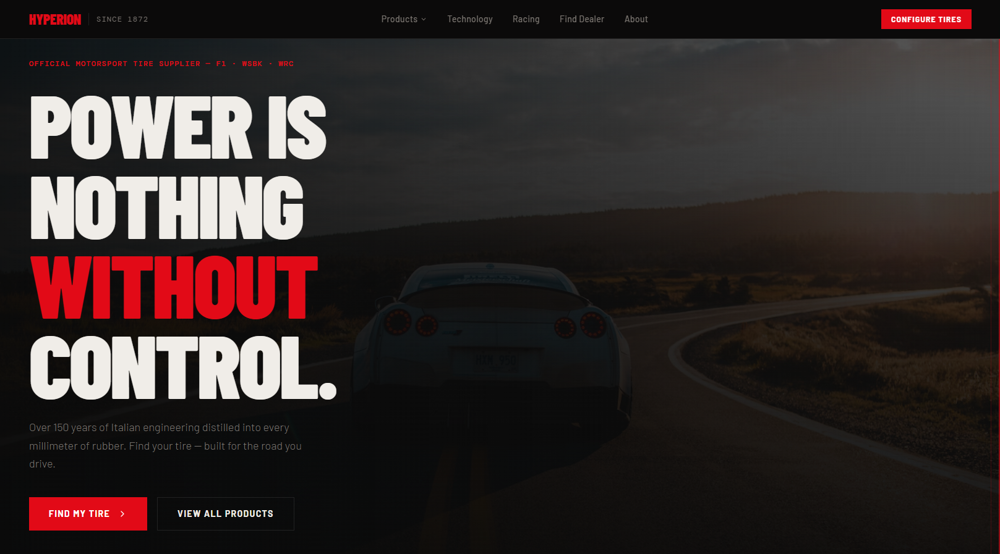

# Hyperion Tire Shop

A modern, premium tire manufacturer website inspired by industry-leading automotive brands. Hyperion Tire Shop showcases high-performance tires through a sleek, responsive, and visually engaging web experience.

## Overview

Hyperion Tire Shop is a frontend web project designed to simulate the online presence of a premium tire manufacturer. The website focuses on strong branding, modern design principles, responsive layouts, and an immersive user experience.

The project was built to demonstrate skills in modern web development, UI implementation, component-based architecture, and deployment workflows.

## Features

- Modern automotive-inspired design
- Responsive layout for desktop, tablet, and mobile devices
- Premium hero section with strong visual branding
- Product showcase sections
- Performance-focused user interface
- Smooth navigation experience
- Optimized frontend architecture
- Clean and maintainable codebase

## Technologies Used

- React
- TypeScript
- Vite
- Tailwind CSS
- HTML5
- CSS3
- JavaScript (ES6+)

## Project Structure

```text
src/
├── components/
├── pages/
├── assets/
├── styles/
└── App.tsx
```

## Installation

Clone the repository:

```bash
git clone https://github.com/yourusername/hyperion-tire-shop.git
```

Navigate to the project directory:

```bash
cd hyperion-tire-shop
```

Install dependencies:

```bash
npm install
```

Start the development server:

```bash
npm run dev
```

## Build for Production

```bash
npm run build
```

## Deployment

The project can be deployed on platforms such as:

- Vercel
- Netlify
- GitHub Pages

## Learning Outcomes

Through this project, I explored:

- Modern React development workflows
- Component-based UI design
- Responsive web development
- Frontend project deployment
- AI-assisted design-to-code workflows
- Building premium brand-focused user interfaces

## Future Improvements

- Product filtering system
- Tire specification comparison tools
- Dealer locator functionality
- Contact and inquiry forms
- Backend integration for inventory management

## Disclaimer

This project is a portfolio and educational project. Hyperion is a fictional tire brand created for demonstration purposes. Any resemblance to existing companies or brands is purely for inspiration and design study.

---

Built with React, TypeScript, Vite, and Tailwind CSS.

